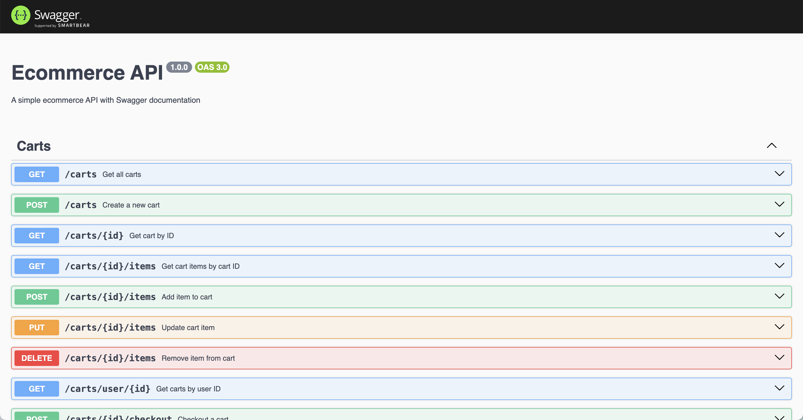

# E-commerce API

This project provides a RESTful API for an e-commerce platform, allowing users to manage products, create carts, place orders, and more.

## Features

* **User Management:**
    * Create new users
    * Retrieve user details
    * Update user information
    * Delete user accounts

* **Product Management:**
    * View a list of all products
    * View a specific product by ID
    * Create new products
    * Update product details
    * Delete products

* **Cart Management:**
    * Create new carts for users
    * View a user's cart
    * Add products to a cart
    * Update cart items
    * Remove items from a cart
    * Checkout a cart and create an order

* **Order Management:**
    * View all orders
    * View a specific order by ID
    * View order items for a specific order

## Technologies Used

* Node.js
* Express.js
* PostgreSQL (or your chosen database)
* bcrypt (for password hashing)
* Passport.js (for authentication)
* Swagger (for API documentation)

## Installation and Setup

1. **Clone the repository:**
   ```bash
   git clone https://github.com/kevveth/ecommerce_project.git
   ```
   
2. **Install dependencies:**
```bash
cd ecommerce_project
npm install
```
3. **Set up environment variables:**

- Create a .env file in the project root.
- Add the following environment variables:
  - DATABASE_URL: Connection string for your database.
  - SESSION_SECRET: A secret key for session management.

 4. **Start the server:**
    ```bash
    npm run devStart
    ```

**API Documentation**

You can view the interactive API documentation at /api-docs endpoint.



**Testing**
To run unit tests:
```bash
npm test
```

**Licensing:**

This project is licensed under the MIT license.


